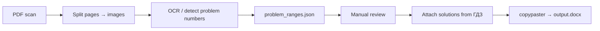

# pagextract

[Русский](readme.md)

Personal pipeline for turning scanned problem books into printable booklets: **problem page + matching solutions → one Word document**.

Built for Russian school/university textbooks (Лукашик and similar), where you need both the original statement scan and downloaded solutions side by side for offline work and printing.

## Scale

Over the lifetime of this tool:

| | |
|---|---|
| Problem books processed | ~10 |
| Source pages (text/scans) | ~3 000 |
| Generated print-ready files | ~80 |
| Pages actually printed | ~20 000 |

This was not a demo — it ran as a real production workflow for preparing study materials.

## Pipeline

1. **Extract pages** from a full-book PDF scan (`cpdf`, ImageMagick).
2. **OCR** page images to recover problem numbers and map them to page ranges.
3. **Human-in-the-loop**: edit `problem_ranges_edited.json` when OCR is wrong; verify with `verify_ranges.py`.
4. **Collect solutions** (userscript → `workdir/sol/`), check gaps with `check_missing_sol.py`.
5. **Assemble** statement images + solution images into `output.docx` via `copypaster.py`.

## OCR evolution

The interesting engineering part is layout-aware number detection (`luk/`, `luk/mytesseract/`): wrapping Tesseract output into rows/geometry, recognizing main and «Д.» problems, validating number sequences.

In practice Tesseract on these scans was too noisy. EasyOCR was tried next. The stable approach that actually shipped materials was **automatic draft ranges + manual correction** — a pragmatic human-in-the-loop design rather than chasing 100% OCR accuracy.

## Stack

- Python, OpenCV, Pillow
- Tesseract / EasyOCR (experiments and drafts)
- `python-docx` for final assembly
- External: `cpdf`, ImageMagick

## Repository layout

| Path | Role |
|---|---|
| `config.py` | Active project directory and image extensions |
| `img_to_data.py` | OCR pages → JSON paragraphs |
| `batch.py` | Draft `problem_ranges.json` from OCR output |
| `verify_ranges.py` / `check_missing_sol.py` | Sanity checks |
| `copypaster.py` | Build the final DOCX |
| `luk/` | Problem/layout model and Tesseract wrappers |

Per-book working data lived under `projects/<book>/` (`src/`, `pars/`, `sol/`, range JSONs) — not required to understand the code.

## Status

Personal production tool. The workflow above was used at the scale described; the repo is kept as a record of that system rather than a polished library.
