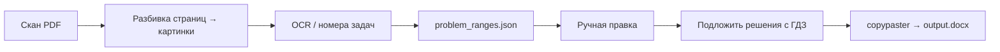

# pagextract

[English](readme.en.md)

Личный пайплайн для превращения сканов задачников в распечатки: **страница с условием + соответствующие решения → один Word-документ**.

Сделан под школьные и вузовские задачники (Лукашик и аналоги): рядом нужны и скан исходной формулировки, и скачанные решения — для офлайн-работы и печати.

## Масштаб

За время использования инструмента:

| | |
|---|---|
| Обработано задачников | ~10 |
| Страниц исходного текста/сканов | ~3 000 |
| Сгенерировано файлов-распечаток | ~80 |
| Напечатано страниц материалов | ~20 000 |

Это не демо — реальный рабочий процесс подготовки учебных материалов.

## Пайплайн

1. **Вырезать страницы** из полного PDF-скана задачника (`cpdf`, ImageMagick).
2. **OCR** картинок страниц — восстановить номера задач и сопоставить их с диапазонами страниц.
3. **Human-in-the-loop**: при ошибках OCR править `problem_ranges_edited.json`; проверять через `verify_ranges.py`.
4. **Собрать решения** (userscript → `workdir/sol/`), пропуски — через `check_missing_sol.py`.
5. **Собрать документ**: картинки условий + картинки решений → `output.docx` скриптом `copypaster.py`.

## Эволюция OCR

Интересная инженерная часть — распознавание номеров с учётом вёрстки (`luk/`, `luk/mytesseract/`): обёртка над выводом Tesseract (строки, геометрия), основные задачи и «Д.»-задачи, проверка последовательности номеров.

На практике Tesseract на этих сканах давал слишком много шума. Дальше пробовали EasyOCR. Рабочий вариант, которым реально гоняли материалы: **авточерновик диапазонов + ручная правка** — прагматичный human-in-the-loop вместо погони за 100% точностью OCR.

## Стек

- Python, OpenCV, Pillow
- Tesseract / EasyOCR (эксперименты и черновики)
- `python-docx` для финальной сборки
- Снаружи: `cpdf`, ImageMagick

## Структура репозитория

| Путь | Назначение |
|---|---|
| `config.py` | Рабочая директория проекта и расширения картинок |
| `img_to_data.py` | OCR страниц → JSON с абзацами |
| `batch.py` | Черновик `problem_ranges.json` по результату OCR |
| `verify_ranges.py` / `check_missing_sol.py` | Проверки |
| `copypaster.py` | Сборка финального DOCX |
| `luk/` | Модель задач/вёрстки и обёртки над Tesseract |

Рабочие данные по каждому задачнику лежали в `projects/<book>/` (`src/`, `pars/`, `sol/`, JSON с диапазонами) — для понимания кода они не обязательны.

## Статус

Личный production-инструмент. Пайплайн выше использовался в описанном масштабе; репозиторий сохранён как запись этой системы, а не как отполированная библиотека.
